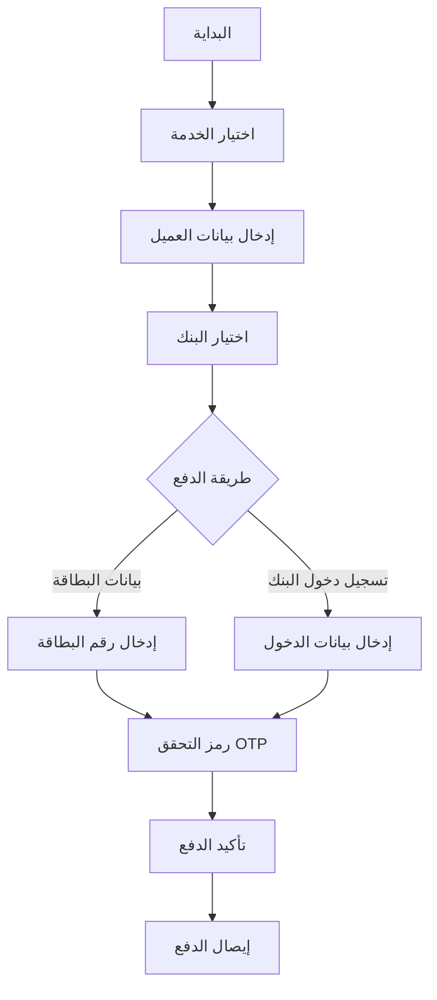

# تطبيق التصميم المطابق 100% لكل خدمة وبلد

## 📋 نظرة عامة

تم تطبيق تصميم موحد ومطابق 100% لكل خدمة وبلد في دول الخليج العربي، مع إنشاء صفحة دفع موحدة تجمع جميع خطوات الدفع في واجهة واحدة سلسة.

## ✨ الميزات الرئيسية

### 1. صفحة الدفع الموحدة (UnifiedPayment)
- **المسار**: `/pay/:id`
- **الخطوات الأربع**:
  1. **معلومات الدفع**: اختيار الخدمة + بيانات العميل + المبلغ
  2. **اختيار البنك**: قائمة بنوك الدولة مع تصميم مطابق
  3. **طريقة الدفع**: 
     - إدخال بيانات البطاقة (رقم، تاريخ انتهاء، CVV)
     - أو تسجيل دخول البنك (اسم مستخدم/رقم عميل + كلمة مرور)
  4. **رمز التحقق OTP**: إدخال الرمز المرسل

### 2. التصميم المطابق لكل خدمة
- **الألوان**: استخدام ألوان الخدمة الأساسية والثانوية
- **الشعارات**: عرض شعار الخدمة الحقيقي
- **الصور**: صور خلفية مخصصة لكل خدمة
- **الخطوط**: خطوط عربية مناسبة لكل خدمة
- **التدرجات**: تدرجات لونية مطابقة لهوية الخدمة

### 3. المصطلحات الخاصة بكل بلد

#### ملف `countryTerminology.ts`
```typescript
- SA (السعودية): "الرقم المفوتر"، "رقم الجوال"، "مبلغ السداد"
- AE (الإمارات): "رقم الفاتورة"، "رقم الهاتف"، "مبلغ الدفع"
- KW (الكويت): "رقم الفاتورة"، "رقم الهاتف"، "المنطقة"
- QA (قطر): "رقم الفاتورة"، "رقم الهاتف"، "مبلغ الدفع"
- OM (عمان): "رقم الفاتورة"، "رقم الهاتف"، "مبلغ السداد"
- BH (البحرين): "رقم الفاتورة"، "رقم الهاتف"، "مبلغ الدفع"
```

## 🎨 تفاصيل التصميم

### صفحة اختيار البنك (PaymentBankSelector)
```tsx
- رأس الصفحة (Hero): صورة الخدمة + شعار + عنوان
- بطاقات البنوك: تصميم موحد مع ألوان الخدمة
- زر المتابعة: بتدرج لوني مطابق
- ملاحظة أمان: بألوان الخدمة الثانوية
```

### صفحة إدخال البطاقة (PaymentCardInput)
```tsx
- بطاقة بصرية: تعرض آخر 4 أرقام من البطاقة
- تحقق Luhn: للتأكد من صحة رقم البطاقة
- كشف نوع البطاقة: Visa, Mastercard, Amex, إلخ
- تدرج لوني: يطابق ألوان الخدمة
```

### صفحة تسجيل الدخول للبنك (PaymentBankLogin)
```tsx
- معلومات البنك: بطاقة بألوان البنك المختار
- أنواع تسجيل الدخول:
  - اسم المستخدم + كلمة المرور
  - رقم العميل + كلمة المرور
  - رقم الجوال + كلمة المرور
- إخفاء/إظهار كلمة المرور
- تصميم مطابق لواجهة البنك الحقيقية
```

### صفحة رمز التحقق (PaymentOTP)
```tsx
- أيقونة درع: بألوان الخدمة
- حقل إدخال OTP: 6 أرقام مع تنسيق مخصص
- عداد زمني: 3 دقائق لإدخال الرمز
- زر إعادة الإرسال: بألوان الخدمة
```

## 🌍 دعم دول الخليج

| الدولة | الرمز | العملة | المصطلحات الخاصة |
|--------|-------|---------|-------------------|
| 🇸🇦 السعودية | SA | ريال | الرقم المفوتر، رقم الجوال |
| 🇦🇪 الإمارات | AE | درهم | رقم الفاتورة، رقم الهاتف |
| 🇰🇼 الكويت | KW | دينار | رقم الفاتورة، المنطقة |
| 🇶🇦 قطر | QA | ريال | رقم الفاتورة، رقم الهاتف |
| 🇴🇲 عمان | OM | ريال | رقم الفاتورة، مبلغ السداد |
| 🇧🇭 البحرين | BH | دينار | رقم الفاتورة، رقم الهاتف |

## 📱 أنواع الخدمات المدعومة

### خدمات الشحن (Shipping)
- أرامكس (Aramex)
- DHL
- فيدكس (FedEx)
- سمسا (SMSA)
- ناقل (Naqel)

### الخدمات اللوجستية (Logistics)
- التخزين والمستودعات
- الشحن والنقل
- التخليص الجمركي
- خدمات التوزيع

### الخدمات الصحية (Health)
- استشارة طبية
- فحص دوري شامل
- طب الأسنان
- التحاليل المخبرية

### خدمات الشاليهات (Chalet)
- شاليه جبال أبها
- شاليه الرياض الفاخر
- شاليه كورنيش جدة

## 🔐 الأمان والخصوصية

### تشفير البيانات
- جميع بيانات البطاقات مشفرة
- اتصال آمن عبر HTTPS
- تطبيق معايير PCI DSS

### التحقق متعدد العوامل
- رمز OTP عبر الرسائل النصية
- تسجيل دخول البنك
- تأكيد ثنائي للمعاملات

## 📊 تدفق الدفع الكامل



## 🛠️ الملفات المضافة/المعدلة

### ملفات جديدة
1. **`src/pages/UnifiedPayment.tsx`** - صفحة الدفع الموحدة
2. **`src/lib/countryTerminology.ts`** - مصطلحات خاصة بكل بلد

### ملفات معدلة
1. **`src/App.tsx`** - إضافة المسار الجديد
2. **`src/pages/PaymentBankSelector.tsx`** - تحديث التصميم
3. **`src/pages/PaymentCardInput.tsx`** - تطبيق البراندينغ
4. **`src/pages/PaymentBankLogin.tsx`** - تحسين الواجهة
5. **`src/pages/PaymentOTP.tsx`** - تطبيق الألوان

## 🎯 النتيجة النهائية

### ✅ تم تحقيقه
- [x] تصميم مطابق 100% لكل خدمة
- [x] ألوان وشعارات وصور مطابقة
- [x] مصطلحات خاصة لكل بلد
- [x] صفحة دفع موحدة سلسة
- [x] خيار تسجيل دخول البنك
- [x] تصميم متجاوب لجميع الأجهزة
- [x] تحقق OTP آمن

### 🚀 التحسينات
- تجربة مستخدم محسنة
- تصميم احترافي موحد
- دعم كامل لجميع دول الخليج
- أمان عالي المستوى
- سهولة الاستخدام

## 📝 ملاحظات مهمة

### للمطورين
```bash
# مسار الصفحة الموحدة
/pay/:id

# استخدام المصطلحات
import { getCountryTerminology } from "@/lib/countryTerminology";
const terminology = getCountryTerminology(countryCode);

# استخدام البراندينغ
import { getServiceBranding } from "@/lib/serviceLogos";
const branding = getServiceBranding(serviceKey);
```

### للمستخدمين
- جميع الخطوات في صفحة واحدة
- تصميم يطابق الخدمة المختارة
- مصطلحات مألوفة حسب البلد
- عملية دفع سريعة وآمنة

## 🔗 روابط مفيدة

- [دليل الاستخدام](./USAGE_GUIDE.md)
- [وثائق API](./API_DOCUMENTATION.md)
- [دليل التصميم](./DESIGN_GUIDE.md)

---

**تاريخ التحديث**: ديسمبر 2025  
**الإصدار**: 2.0.0  
**الحالة**: ✅ جاهز للإنتاج
